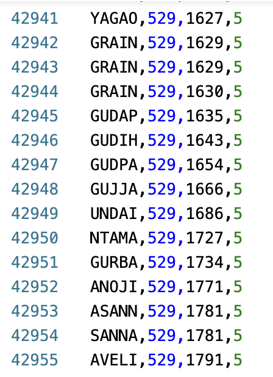

# locator

Performance enhanced, vector based suggestion api.

### How it works
1. Loops through locations dataset and creates a vector based dataset of all the locations, making them easy for the CPU to process in long-run.
2. These vectors are then used to find the closest location to the user's location.
3. The api will provide location based suggestions considering the input from user.

### Demo

#### Dataset
https://data.opendatasoft.com/api/explore/v2.1/catalog/datasets/geonames-postal-code@public/exports/json?lang=en&timezone=Asia%2FKolkata

place -> city, state, country, zip code
abc
adcd 
abcde 
